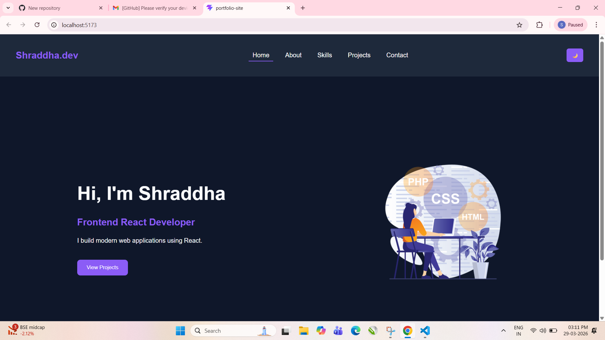
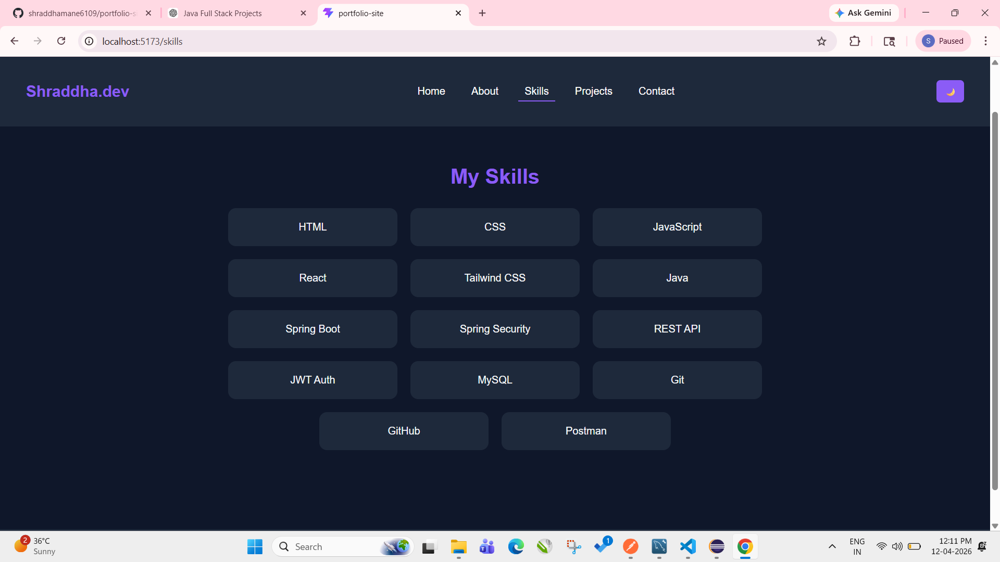
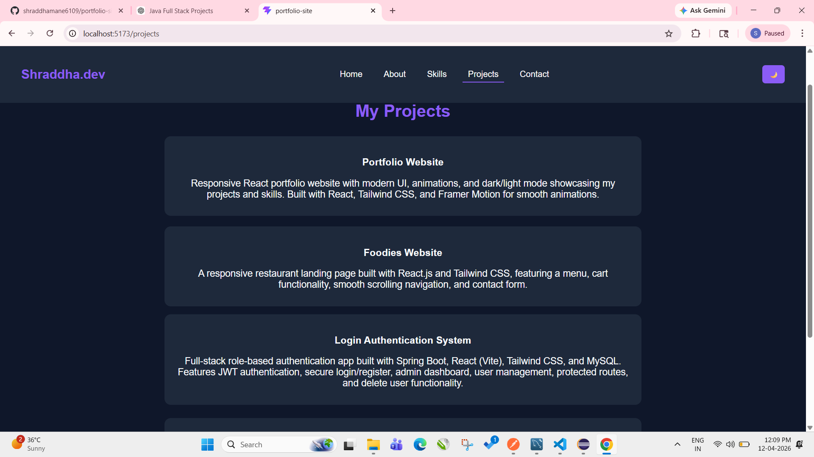

# 🌐 Shraddha's Portfolio Website

A modern and responsive portfolio website built using React and Vite to showcase my projects, skills, and contact information.

---

## 🚀 Features

- 🌙 Dark / Light Mode Toggle
- 🎨 Modern UI Design
- ⚡ Fast Performance with Vite
- 🎬 Smooth Animations (Framer Motion)
- 📱 Fully Responsive Design
- 📁 Projects Showcase
- 📞 Contact Form

---

## 🛠 Tech Stack

- React
- Vite
- JavaScript
- CSS
- Framer Motion

---

## 📂 Project Structure

src/
│
├── components/
│ ├── Navbar.jsx
│ └── Footer.jsx
│
├── pages/
│ ├── Home.jsx
│ ├── About.jsx
│ ├── Skills.jsx
│ ├── Projects.jsx
│ └── Contact.jsx
│
├── App.jsx
├── App.css
└── main.jsx

---

## 📸 Preview
### 🏠 Home Page

### 👩‍💻 Skills Page

### 📁 Projects Page

---

## 💡 Future Improvements

- Add backend for contact form
- Add project images & live demo links
- Improve animations
- Add resume download option

---

## 🙋‍♀️ Author

**Shraddha Mane**

---

## ⭐ Show your support

Give a ⭐ if you like this project!
